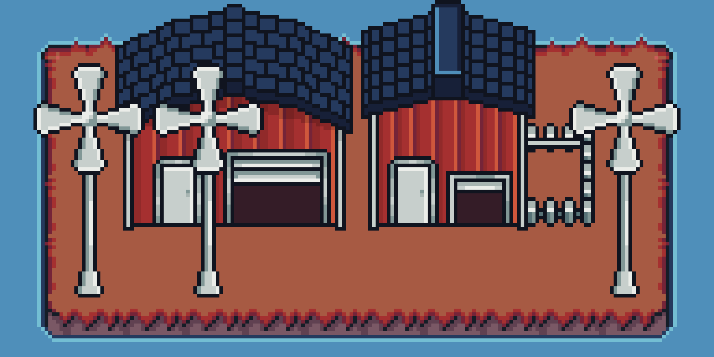
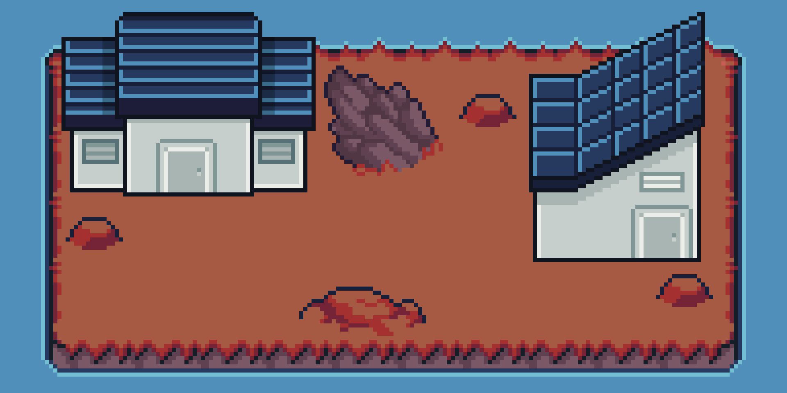
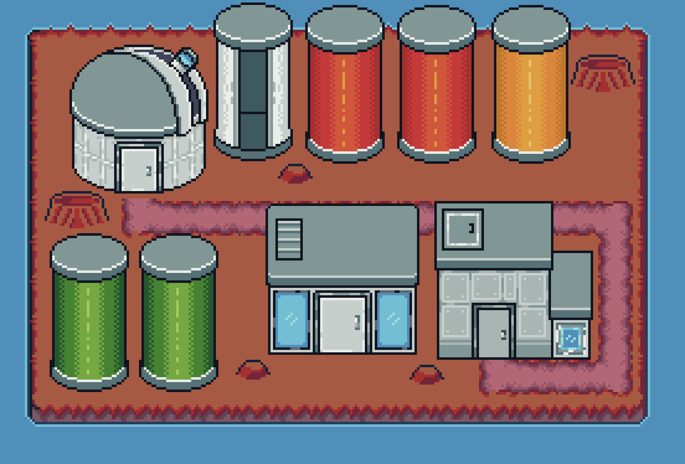
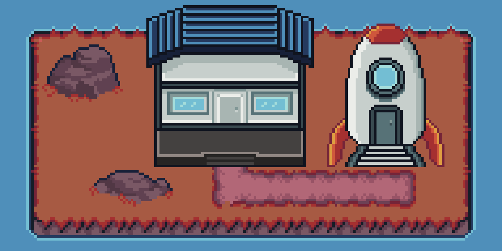
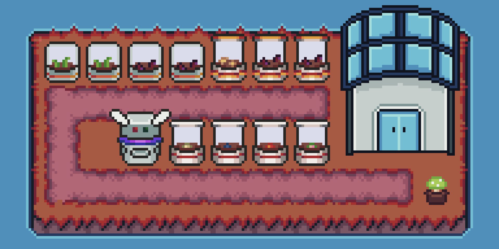
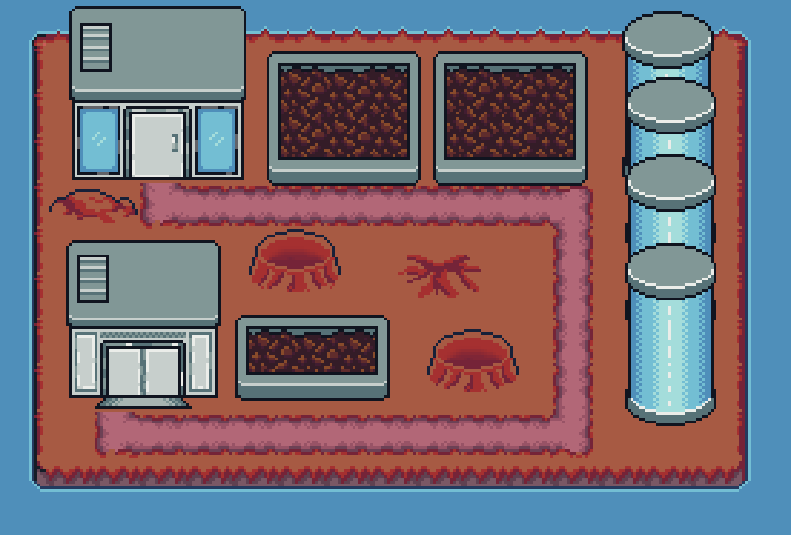

## Farming, far from home

Astronaut Farm combines the warmth of a farming game with a compact science-fiction world. The expanding pack includes 11 crops, more than 90 minerals, over 30 outdoor decorations, 10+ fungi, 10+ buildings, furniture, and an astronaut with walking and defeat animations.

Its terrain system covers land, paths, water, farmland, room building, and world barriers. Every object is designed to stay readable on a 16×16 grid while carrying enough personality to suggest a much larger world. Free personal use and paid commercial licenses are available on Itch.io.

